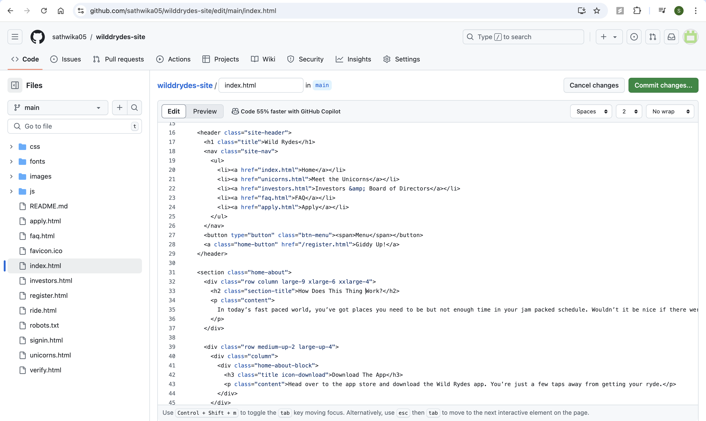
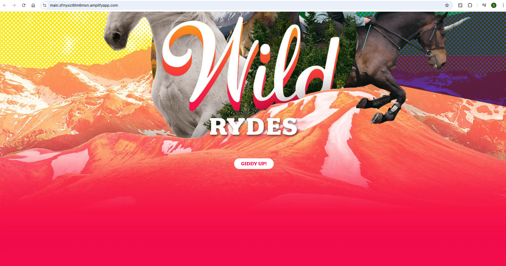

# WildRydes - Ride Sharing App

WildRydes is a fun, fictional ride-sharing application built using AWS services such as Cognito for authentication, Lambda for backend logic, DynamoDB for storage, and API Gateway for API management. This project demonstrates how to integrate these services for a seamless ride-request flow where users can register, log in, and request unicorn rides.

---

## Table of Contents
1. [Project Setup](#project-setup)
   - [Create and Clone GitHub Repo](#create-and-clone-github-repo)
   - [Connect Amplify for CI/CD](#connect-amplify-for-cicd)
2. [User Authentication](#user-authentication)
   - [Create Cognito User Pool](#create-cognito-user-pool)
   - [Update GitHub Repo with Cognito IDs](#update-github-repo-with-cognito-ids)
3. [Ride Request Functionality](#ride-request-functionality)
   - [Set Up DynamoDB Table](#set-up-dynamodb-table)
   - [Create IAM Role](#create-iam-role)
   - [Create Lambda Function](#create-lambda-function)
   - [Test Lambda and DynamoDB Integration](#test-lambda-and-dynamodb-integration)
4. [API Gateway Integration](#api-gateway-integration)
   - [Create API Gateway](#create-api-gateway)
   - [Configure API Gateway Authorizer](#configure-api-gateway-authorizer)
   - [Create Resource and Method](#create-resource)
5. [Test the Ride Functionality](#test-the-ride-functionality)
6. [Conclusion](#conclusion)

---

## Project Setup

### Create and Clone GitHub Repo

1. Create a new GitHub repository and clone the WildRydes site into your repo.
   


  

### Connect Amplify for CI/CD

1. Connect the GitHub repository to AWS Amplify for continuous deployment and integration. Select the desired GitHub repository from the Amplify dashboard.
    

2. If your repository does not appear, ensure your GitHub permissions are correctly updated.
   
  
3. Click `Next` and review the configuration.
    
   
4. Save and deploy the app.
   
   
5. Once deployment is completed, click the domain URL to check the app.
   

6. Now lets test the integration. Modify the index.html in the browser and commit.
Modifying this line 
```
<h2 class="section-title">How Does This Work?</h2>
 to 
<h2 class="section-title">How Does This Thing Work?</h2>
```
   
   
7. This triggers the deployment in amplify
   
    
   
8. Once the deployment completes, we can see the changes reflected same domain url application
    
   
---

## User Authentication

### Create Cognito User Pool

 

1. Go to AWS Cognito and create a new user pool.
   

2. Select `Single-page application (SPA)` as the application type and name it `WildRydes`.
   

3. Choose the required attributes for sign-up.
   

4. User Pool is created
    

6. After the user pool is created, click on it and copy the **User Pool ID**.
   

7. Click on Set up your app : WildRydes and grab the client ID
   

### Update GitHub Repo with Cognito IDs

1. Navigate to `wildrydes-site/js/config.js` in the GitHub repo and add the **User Pool ID** and **Client ID** you obtained from Cognito into the configuration.
   

2. Commit the changes to trigger a new deployment in Amplify.
   

3. We can click on the domain url and click on GIDDY UP!
   
   
5. It navigates to the registration page
   

6. Give the details and click on LET’S RYDE
    
   
7. Verify the email address
   

8. Login after verification
    
   
9. The page is not the desired one. Just copy the token in if you'd like to test the Amazon Cognito user pool authorizer for your API, use the auth token below:
    
    

---

## Ride Request Functionality

The next feature we’ll focus on is Ride Sharing, where users can request a unicorn, and one will be dispatched to their location.

To implement this, we will leverage AWS Lambda, which will be triggered whenever a user requests a unicorn ride. The user’s request will invoke a Lambda function that selects an available unicorn from the fleet and records the request in a DynamoDB table (a NoSQL database).

The process will look as follows:

User Request: When a user requests a unicorn, the Lambda function is triggered.
Unicorn Selection: The Lambda function selects the appropriate unicorn from the fleet based on availability and proximity.
Data Storage: The ride request details are then recorded in a DynamoDB table.
Response to Frontend: Finally, the Lambda function responds to the frontend with the details of the unicorn that has been dispatched, including the unicorn’s ID, location, and estimated arrival time.

### Set Up DynamoDB Table

1. Go to the DynamoDB console and create a new table.
   

2. Set the table name (e.g., `Rides`) and use `RideId` as the Partition key. Leave other settings as default and create the table.
   

3. Table will be created. 
   

4. Once the table is created, click on it to open its details page. From there, copy the ARN, which can be found under the 'Additional Information' section.
   

### Create IAM Role

Next, we need to create an execution role that allows the Lambda function to write to the DynamoDB table. Follow these steps:

1. Navigate to the IAM console and click on Create role.


2. For the trusted entity, select AWS service, and under Use case, choose Lambda.


3. In the next screen, select the AWSLambdaBasicExecutionRole policy, then click Next.


4. Enter a name for the role, scroll down, and click Create role to finalize the creation.


5. The role is now created. Click on the newly created role to open its details page.


6. To add additional permissions, click on Add inline policy on the right side of the page.


7. Select DynamoDB as the service, then filter the actions to include PutItem (for inserting items into the table). You’ll need to specify the table that the Lambda function will access. Use the ARN (Amazon Resource Name) that was copied earlier when you created the DynamoDB table. Click Add ARN to include the specific ARN for your table.


8. Click Next, then give the policy a name (e.g., LambdaDynamoDBPolicy), and click Create policy.


9. The role now has the necessary permissions to allow the Lambda function to write to the DynamoDB table.


### Create Lambda Function

1. Create a new Lambda function from scratch, provide a name, select the runtime environment, and assign the previously created execution role (WildRydesLambda), then click Create function.
   

2. Paste the following code into the Lambda function:

```
import { randomBytes } from 'crypto';
import { DynamoDBClient } from '@aws-sdk/client-dynamodb';
import { DynamoDBDocumentClient, PutCommand } from '@aws-sdk/lib-dynamodb';

const client = new DynamoDBClient({});
const ddb = DynamoDBDocumentClient.from(client);

const fleet = [
    { Name: 'Angel', Color: 'White', Gender: 'Female' },
    { Name: 'Gil', Color: 'White', Gender: 'Male' },
    { Name: 'Rocinante', Color: 'Yellow', Gender: 'Female' },
];

export const handler = async (event, context) => {
    if (!event.requestContext.authorizer) {
        return errorResponse('Authorization not configured', context.awsRequestId);
    }

    const rideId = toUrlString(randomBytes(16));
    console.log('Received event (', rideId, '): ', event);

    const username = event.requestContext.authorizer.claims['cognito:username'];
    const requestBody = JSON.parse(event.body);
    const pickupLocation = requestBody.PickupLocation;

    const unicorn = findUnicorn(pickupLocation);

    try {
        await recordRide(rideId, username, unicorn);
        return {
            statusCode: 201,
            body: JSON.stringify({
                RideId: rideId,
                Unicorn: unicorn,
                Eta: '30 seconds',
                Rider: username,
            }),
            headers: {
                'Access-Control-Allow-Origin': '*',
            },
        };
    } catch (err) {
        console.error(err);
        return errorResponse(err.message, context.awsRequestId);
    }
};

function findUnicorn(pickupLocation) {
    console.log('Finding unicorn for ', pickupLocation.Latitude, ', ', pickupLocation.Longitude);
    return fleet[Math.floor(Math.random() * fleet.length)];
}

async function recordRide(rideId, username, unicorn) {
    const params = {
        TableName: 'Rides',
        Item: {
            RideId: rideId,
            User: username,
            Unicorn: unicorn,
            RequestTime: new Date().toISOString(),
        },
    };
    await ddb.send(new PutCommand(params));
}

function toUrlString(buffer) {
    return buffer.toString('base64')
        .replace(/\+/g, '-')
        .replace(/\//g, '_')
        .replace(/=/g, '');
}

function errorResponse(errorMessage, awsRequestId) {
    return {
        statusCode: 500,
        body: JSON.stringify({
            Error: errorMessage,
            Reference: awsRequestId,
        }),
        headers: {
            'Access-Control-Allow-Origin': '*',
        },
    };
}

```
 

 3. Update the DynamoDB table name in the Lambda function code to match the name of your created table.
 

 4. Then deploy it.
 

### Test Lambda and DynamoDB Integration
1. First, create a test event to verify that the Lambda function works as expected. In the Lambda console, click on Test and choose Configure test event.
Then, copy and paste the following JSON code into the Event JSON field:
```
{
    "path": "/ride",
    "httpMethod": "POST",
    "headers": {
        "Accept": "*/*",
        "Authorization": "eyJraWQiOiJLTzRVMWZs",
        "content-type": "application/json; charset=UTF-8"
    },
    "queryStringParameters": null,
    "pathParameters": null,
    "requestContext": {
        "authorizer": {
            "claims": {
                "cognito:username": "the_username"
            }
        }
    },
    "body": "{\"PickupLocation\":{\"Latitude\":47.6174755835663,\"Longitude\":-122.28837066650185}}"
}
```
Save the test event.

 
 
2. After saving the test event, click on Test to execute the test. Select the test event you just created and click Test again.


3. You should receive a response. If the response status is 201 Created, it means the function is working as expected.
 

4. Now, you can check your DynamoDB table to confirm that the entry has been successfully added.
 

## API Gateway Integration

### Create API Gateway
1. In the API Gateway console, click Create API.
   [Step 46](images-1/46.png)
   
2. Select REST API (not WebSocket) and click Build.
   [Step 47](images-1/47.png)
   
3. Provide a name for the API (e.g., WildRydesAPI) and click Create API to proceed.
   [Step 48](images-1/48.png)
   

### Configure API Gateway Authorizer

1. Since we are using Amazon Cognito User Pool for authentication, we need to set up an authorizer in API Gateway. Navigate to Authorizers under your newly created API and click Create New Authorizer.
 [Step 49](images-1/49.png)

2. Configure the Authorizer:

Provide a name for the authorizer (e.g., CognitoAuthorizer).
Select your Cognito User Pool and set the Token source as Authorization (the name of the HTTP header containing the authorization token).
Click Create to finish setting up the authorizer.
  [Step 50](images-1/50.png)
  [Step 51](images-1/51.png)

3. You can test the authorizer functionality here. Paste the token (the Authorization token you obtained earlier) into the field, then click Test Authorizer.
  [Step 52](images-1/52.png)
  [Step 53](images-1/53.png)
  [Step 54](images-1/54.png)

4. If the authorizer is working correctly, you will receive a status code 200. This confirms that the token is valid, and the authorization is successful.
    [Step 55](images-1/55.png)

### Create Resource and Method

1. Go to the Resources section of the API and click Create Resource. This is where we will connect the Lambda function to the API.
   [Step 56](images-1/56.png)

2. In the Create Resource screen, set the Resource Path as / (or another path that suits your app). Enable CORS to allow cross-origin requests.
   [Step 57](images-1/57.png)

3. Click Create Method below the newly created resource.
   [Step 58](images-1/58.png)

4. Choose POST as the method type, select Lambda Function as the integration type, and enable Lambda Proxy Integration. Then, select the Lambda function that should be invoked.
    [Step 59](images-1/59.png)

5. Under the Method Request tab, click Edit to configure authorization settings.
   [Step 60](images-1/60.png)

6. In the Authorization section, enter the Authorization name that corresponds to the Cognito authorizer you created earlier. Then click Save to apply the changes.
   [Step 61](images-1/61.png)

7. Now, we need to deploy the API. Click Actions at the top and select Deploy API.
    [Step 62](images-1/62.png)

8. In the deployment dialog, select New Stage and give it a name, such as dev. Then click Deploy to finalize the deployment process.
   [Step 63](images-1/63.png)

9. After deployment, you will be provided with an Invoke URL. Copy the URL, which will look something like this:
https://9ctfga027g.execute-api.us-east-1.amazonaws.com/dev. This URL will be used to call your API.

 [Step 64](images-1/64.png)


## Test the Ride Functionality

1. Now, we need to update the GitHub config file to use the Invoke URL of the deployed API. Navigate to the relevant configuration file (e.g., config.js) in your repository and replace with the new Invoke URL. After making the change, commit the updates.
 [Step 65](images-1/65.png)

2. Committing the changes to GitHub will automatically trigger a new deployment in AWS Amplify.

3. Once the deployment is complete, you can test the ride functionality by visiting the ride.html page. You can access it at the following URL:
https://main.d1nyxcl6lm6mxn.amplifyapp.com/ride.html.
  [Step 66](images-1/66.png)

4. On the ride.html page, simply click the button to Request a Unicorn.
    [Step 67](images-1/67.png)
   
5. After you click Request Unicorn, the unicorn will be dispatched to the requested location.
    [Step 68](images-1/68.png)

6. Finally, check the DynamoDB table to ensure that the ride request has been recorded. You should see a new entry for the ride request.


## Conclusion

In this project, we successfully built a serverless ride-sharing app, WildRydes, using AWS services like Cognito for authentication, Lambda for backend logic, DynamoDB for data storage, and API Gateway for API management. We integrated these services to create a seamless user experience for requesting unicorn rides. The app is fully functional, scalable, and continuously deployed via AWS Amplify. This project demonstrates the power of AWS in building efficient, serverless applications.


 
